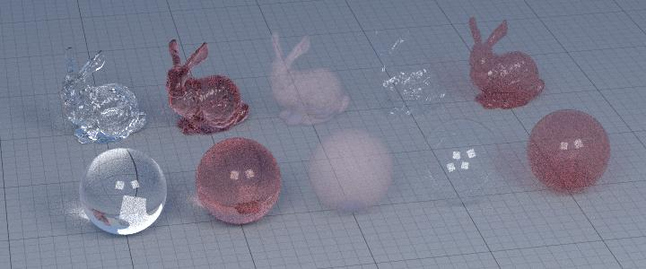
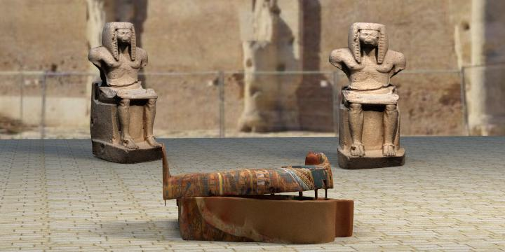
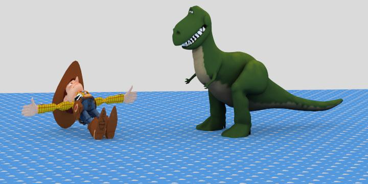
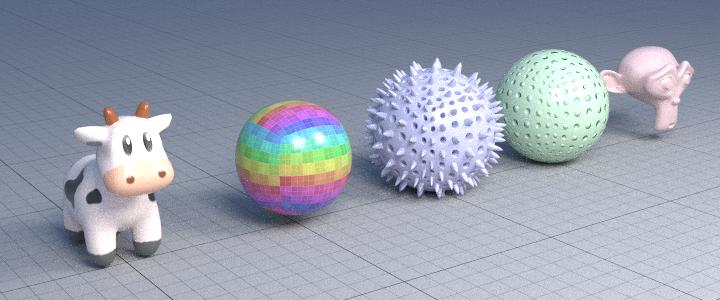

# Fundamentals of Computer Graphics course

## Slides
You can read all the published slides [here](./all-slides.pdf)

## This course can be achieved completing 3 homeworks, here you have a resume of results

## First Homework Results

#### The Description of what i had to to implement is inside the [readme](./homework1/readme.md) file.

## Second Homework Results

#### The Description of what i had to to implement is inside the [readme](./homework2/readme.md) file.

## Third Homework Results

#### The Description of what i had to to implement is inside the [readme](./homework3/readme.md) file.

_This readme formatting ideda has been taken from a collegue of mine [Flavio Lorenzi](https://github.com/FlavioLorenzi). 

